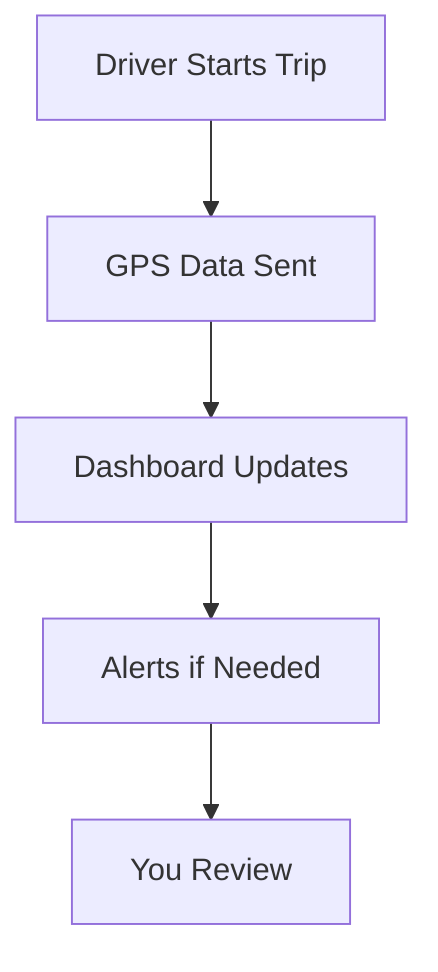

## Overview

VEC Fleet centralizes your fleet operations with real-time insights and automation. You track vehicles, schedule maintenance, and analyze expenses through an intuitive dashboard. These core features help you reduce downtime, control costs, and boost productivity across your Latin American operations.

<Columns cols={3}>
  <Card title="Real-time Monitoring" icon="map-pin" href="/docs/monitoring">
    Track vehicle locations and status in real time.
  </Card>
  <Card title="Automated Scheduling" icon="calendar" href="/docs/scheduling">
    Set rules for proactive maintenance alerts.
  </Card>
  <Card title="Expense Reporting" icon="bar-chart-3" href="/docs/reporting">
    Generate custom reports on fuel and repairs.
  </Card>
</Columns>

## Real-time Vehicle Monitoring and Tracking

You access live GPS data for over 70,000 vehicles. The platform displays speed, location, and fuel levels on interactive maps. Set geofences to receive alerts when vehicles enter or exit zones.

<Callout kind="tip">
  Enable notifications for idle vehicles longer than `{30}` minutes to optimize fuel use.
</Callout>

Here's a simple workflow:



<Tabs>
  <Tab title="Web Dashboard" icon="globe">
    View the fleet map and filter by vehicle type.

    ```javascript
    // Fetch live vehicle data
    const vehicles = await fetch('/api/fleet/vehicles?status=active');
    const data = await vehicles.json();
    console.log(data); // { vehicles: [{ id: 'veh-123', lat: -23.55, lng: -46.63, speed: 65 }] }
    ```
  </Tab>
  <Tab title="Mobile App" icon="smartphone">
    Get push alerts on your phone.

    ```javascript
    // React Native integration example
    import { VECFleet } from 'vec-fleet-sdk';
    const client = new VECFleet('your-api-key');
    client.trackVehicle('veh-123').then(status => {
      console.log(status.fuelLevel); // 75%
    });
    ```
  </Tab>
</Tabs>

## Automated Maintenance Scheduling

You define maintenance rules based on mileage, engine hours, or time intervals. The system schedules services automatically and notifies technicians.

<Steps>
  <Step title="Create Rule" icon="plus">
    Navigate to Settings > Maintenance Rules.

    Add a rule for oil changes every `{5000}` km.
  </Step>
  <Step title="Assign Vehicles" icon="truck">
    Select your fleet groups, like "Delivery Trucks".
  </Step>
  <Step title="Monitor Schedule" icon="check-circle">
    Review the calendar and approve bookings.
  </Step>
</Steps>

<CodeGroup tabs="JavaScript,Python">
  ```javascript
  // API call to create maintenance rule
  await fetch('/api/maintenance/rules', {
    method: 'POST',
    body: JSON.stringify({
      name: 'Oil Change',
      trigger: 'mileage',
      threshold: 5000,
      vehicles: ['veh-123', 'veh-456']
    })
  });
  ```
  ```python
  # Python SDK example
  import vecfleet
  client = vecfleet.Client('your-api-key')
  rule = client.create_rule(
      name='Oil Change',
      trigger='mileage',
      threshold=5000,
      vehicles=['veh-123', 'veh-456']
  )
  print(rule.id)
  ```
</CodeGroup>

## Expense Tracking and Customized Reporting

You log fuel purchases, repairs, and tolls directly. Generate reports filtered by vehicle, driver, or period to identify cost-saving opportunities.

| Report Type | Key Metrics | Export Formats |
|-------------|-------------|----------------|
| Fuel Usage | Liters/km, Total Cost | PDF, CSV, Excel |
| Maintenance | Downtime Hours, Parts Cost | PDF, CSV |
| Overall | Expenses by Category | PDF, Excel |

<Expandable title="Advanced Reporting Filters" default-open="false">

Customize with SQL-like queries:

````javascript
// Example filter query
const report = await client.reports.generate({
  filters: {
    dateRange: '2024-01-01 to 2024-12-31',
    vehicleType: 'heavy-duty',
    expenseType: ['fuel', 'repairs']
  }
});
````

</Expandable>

These features integrate seamlessly, giving you full control over your fleet. Start by connecting your vehicles to unlock real-time optimization.