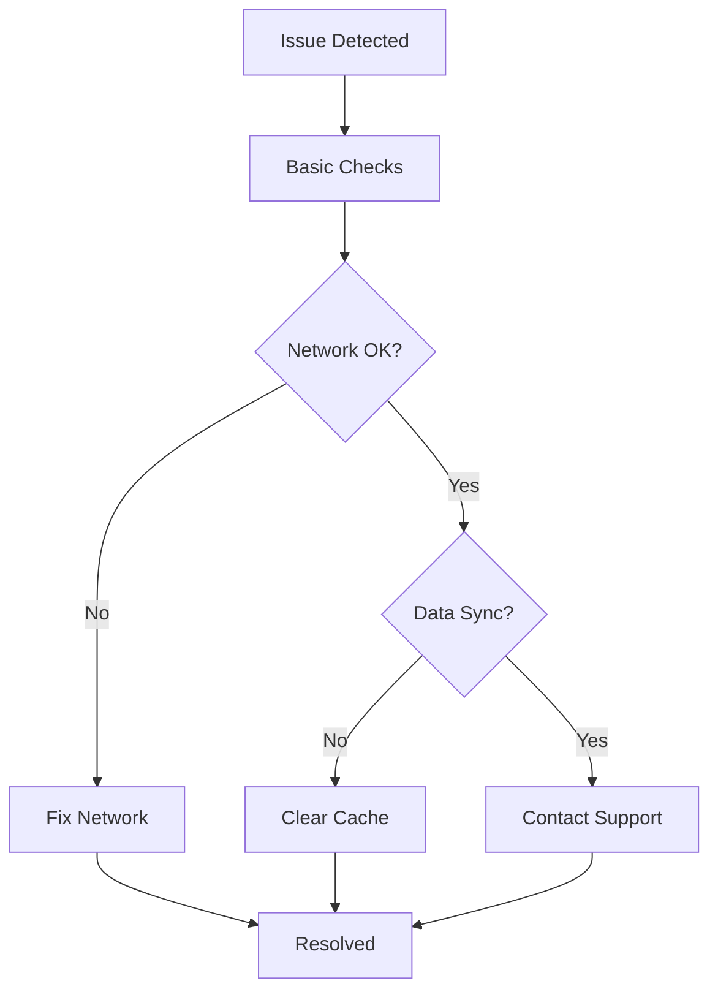

## Connectivity and Data Sync Issues

VEC Fleet relies on stable internet connections for real-time vehicle tracking and data synchronization. If you experience delays or failures in data updates, follow these steps to diagnose and resolve the issue.

<Callout kind="tip">
  Check your network first. VEC Fleet requires `<50ms` latency and `>95%` packet loss tolerance for optimal performance.
</Callout>

<Steps>
  <Step title="Verify Network Connection" icon="wifi">
    Open your browser's developer tools and test connectivity to the VEC Fleet API endpoint.

    <CodeGroup tabs="cURL,JavaScript">
      ```bash
      curl -I https://api.vecfleet.com/status
      ```
      ```javascript
      fetch('https://api.vecfleet.com/status')
        .then(response => response.json())
        .then(data => console.log(data));
      ```
    </CodeGroup>
  </Step>

  <Step title="Clear Browser Cache" icon="trash-2">
    Clear your browser cache and cookies for the VEC Fleet domain to eliminate corrupted data.

    In Chrome: Press `Ctrl` + `Shift` + `Delete` and select "Cached images and files".
  </Step>

  <Step title="Restart VEC Fleet App" icon="refresh-cw">
    Log out, close the app, and log back in. This refreshes the authentication token.
  </Step>

  <Step title="Contact Support" icon="mail">
    If issues persist, submit a ticket with your browser console logs and network screenshots.
  </Step>
</Steps>

## Maintenance Schedule Errors

Maintenance schedules in VEC Fleet automate reminders based on mileage and time. Errors often stem from incorrect vehicle data or configuration mismatches.

<Tabs>
  <Tab title="Mileage-Based Errors" icon="road">
    Ensure vehicle odometer readings sync correctly.

    <ParamField path="vehicles/{id}/odometer" param-type="number" required="true">
      Current mileage value from GPS device.
    </ParamField>

    Common fix: Update the vehicle's GPS integration settings via the admin dashboard.
  </Tab>

  <Tab title="Time-Based Errors" icon="clock">
    Verify timezone settings match your fleet's location.

    ```javascript
    // Check current timezone in console
    console.log(Intl.DateTimeFormat().resolvedOptions().timeZone);
    ```

    Set to `America/Sao_Paulo` for Brazil operations or your regional equivalent.
  </Tab>
</Tabs>

<Callout kind="alert">
  Never manually override automated schedules without logging the reason to maintain compliance records.
</Callout>

## Report Generation Troubleshooting

Reports may fail due to data volume, filters, or export limits. Review these common issues.

| Error Code | Description | Resolution |
|------------|-------------|------------|
| REP-001 | Timeout on large datasets | Apply date range filters to reduce data (`<10,000` records) |
| REP-002 | Invalid export format | Use supported formats: PDF, CSV, Excel |
| REP-003 | Permission denied | Grant `reports:export` role to the user |

<Expandable title="Advanced Diagnostics" default-open="false">
  Run this diagnostic query in the VEC Fleet API console:

  ```sql
  SELECT COUNT(*) as vehicle_count,
         AVG(fuel_consumption) as avg_fuel
  FROM fleet_reports
  WHERE date > '2024-01-01'
    AND status = 'active';
  ```

  If `vehicle_count > 50,000`, split reports by region.
</Expandable>

## Quick Resolution Resources

<Columns cols={3}>
  <Card title="API Status" icon="activity" href="https://status.vecfleet.com" target="_blank">
    Check live API uptime and incidents.
  </Card>

  <Card title="Support Portal" icon="help-circle" href="/support/tickets">
    Submit detailed logs for priority help.
  </Card>

  <Card title="User Forum" icon="message-circle" href="https://forum.vecfleet.com" target="_blank">
    Search community solutions.
  </Card>
</Columns>



Follow these steps to minimize downtime and keep your fleet operations running smoothly. Most issues resolve within minutes using the provided diagnostics.